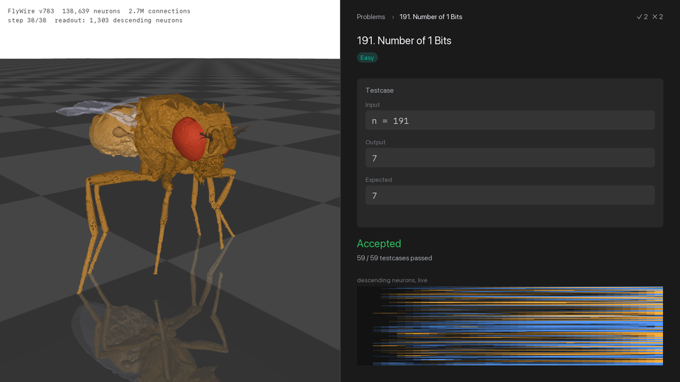

# Fly Brain LeetCode

<p align="center"></p>

I took the complete wiring diagram of an adult fruit fly brain and made it answer LeetCode problems. The brain is FlyWire's v783 connectome, with 138,639 neurons and 2.7 million connections, and it is the same data behind the Eon Systems whole-brain emulation. Its wiring is never changed. Problems go in through its taste, touch and smell neurons one symbol at a time, and answers are read off the 1,303 descending neurons that carry commands from the brain to the body. The only thing trained is a linear readout on those neurons.

It is judged the way LeetCode judges, on hidden test cases it has never seen, and a problem counts as Accepted only if every test passes. The fly is Accepted on 3 of 12 Easy problems: Number of 1 Bits, Majority Element and Missing Number. The first version of the readout only managed 1, and the reason is the most useful thing this project found.

## Results

Each cell is hidden test cases passed. "v1" is the first readout, kept in `results/v1/`. "v2" is the current one, and "chosen" is the readout head and gain that validation picked for it. "Shuffled" keeps every neuron, weight and sign but rewires where connections land, and goes through the same v2 search. "Order-blind" is the best any method can score while ignoring the order of the symbols, computed with a lookup table on symbol counts. Chance is always guessing the most common answer.

| Problem | Fly v1 | Fly v2 | Chosen | Shuffled | Order-blind | Chance | Verdict |
| --- | --- | --- | --- | --- | --- | --- | --- |
| 1. Two Sum | 294/1000 | 225/1000 | label, 2 | 354/1000 | 110/1000 | 146/1000 | Wrong Answer |
| 9. Palindrome Number | 818/1000 | 827/1000 | label, 2 | 915/1000 | 864/1000 | 686/1000 | Wrong Answer |
| 20. Valid Parentheses | 637/1000 | 609/1000 | label, 4 | 751/1000 | 675/1000 | 217/1000 | Wrong Answer |
| 58. Length of Last Word | 128/156 | 82/156 | label, 2 | 130/156 | 51/156 | 7/156 | Wrong Answer |
| 121. Best Time to Buy and Sell Stock | 742/1000 | 686/1000 | label, 4 | 868/1000 | 595/1000 | 279/1000 | Wrong Answer |
| 136. Single Number | 254/330 | 257/330 | label, 2 | 329/330 | 330/330 | 52/330 | Wrong Answer |
| 169. Majority Element | 204/208 | 208/208 | label, 2 | 208/208 | 208/208 | 72/208 | Accepted |
| 191. Number of 1 Bits | 3/59 | 59/59 | number, 2 | 59/59 | 59/59 | 0/59 | Accepted |
| 217. Contains Duplicate | 814/1000 | 769/1000 | label, 4 | 993/1000 | 1000/1000 | 495/1000 | Wrong Answer |
| 268. Missing Number | 1000/1000 | 1000/1000 | label, 2 | 1000/1000 | 1000/1000 | 145/1000 | Accepted |
| 485. Max Consecutive Ones | 151/211 | 108/211 | number, 2 | 190/211 | 102/211 | 76/211 | Wrong Answer |
| 1822. Sign of the Product of an Array | 646/1000 | 680/1000 | label, 2 | 701/1000 | 999/1000 | 300/1000 | Wrong Answer |

## What the results say

**The fly could count all along, and my readout could not.** v1 read every answer as one of several unrelated labels. A linear readout cannot pick the middle values of one ordered quantity that way, so Number of 1 Bits scored 3 of 59. The clue was in the v1 baseline, which was given the exact number of ones and still scored 0 of 59. v2 can also read an answer as a single number and round it. With the same frozen brain, Number of 1 Bits went to 59 of 59 on inputs it had never seen.

**The problems it solves are the ones that are sums.** The readout is a weighted sum of what the neurons are doing at the end, so it can answer anything the brain keeps as an accumulated total. Counting ones, finding the majority and finding the missing number are all like that. The other nine need a stack, a comparison between two elements, or a parity, which is not a sum. Sign of the Product shows it best. A method that only counts symbols gets 999 of 1000, because the sign depends only on whether the number of negatives is odd, and the fly gets 680. Getting all twelve would need either a nonlinear model on top of the brain, which would then be the thing solving the problem, or trained synapses, which would stop it being the fly's brain.

**The fly's own wiring is not what helps.** The shuffled brain matched the real one on the three solved problems and beat it on the other nine. In v1, `scripts/robust.py` reran Valid Parentheses and Best Time to Buy and Sell Stock with three real-fly seeds and three different shufflings, each with its own best gain. Every shuffled brain beat every real one on both problems, with means of 75.7% against 65.8% and 84.9% against 71.2%. Whatever the fly's wiring is tuned for, it is not holding a stack of brackets.

**It does carry order.** On Two Sum, Length of Last Word, Best Time to Buy and Sell Stock and Max Consecutive Ones, the fly beats the best any order-blind method can do. Something in its dynamics remembers what came first.

**Validation does not always pick well.** v2 chooses the gain and the head on validation data, and on some problems that choice did worse on the hidden tests than v1's fixed gain of 4. Length of Last Word fell from 128 to 82 of 156. The v2 numbers are reported as they came out.

**The first good number was memorisation.** An early pilot scored 80% on Number of 1 Bits because the same inputs appeared in training and testing, and the problem only has 256 possible inputs. `flybrain/dataset.py` now hashes each input to decide its split, so test cases are never seen in training, and it keeps LeetCode's convention that test cases are distinct.

## How it works

The brain is a rate model. At every substep each neuron updates as `r ← (1 − leak)·r + leak·tanh(gain·W·r + u)`. `W` holds synapse counts signed by predicted neurotransmitter, with each neuron's inputs normalised by its total absolute input so one global gain sets the regime. Connections with fewer than five synapses are dropped, which is the usual FlyWire threshold.

Each symbol in a problem's alphabet gets a fixed random group of 40 neurons drawn from the 5,577 non-visual sensory neurons. A symbol is shown for three substeps and followed by one silent substep, so `"11"` differs from `"1"`. After the last symbol the network settles for six substeps. A ridge regression then maps the descending neurons' activity to the answer. For each problem, `run.py` tries gains 2 and 4, a label head and (for integer answers) a number head, and six ridge penalties, picks the best on the validation split, and scores the hidden tests once.

## Limits

It is a rate model, which is a simplification of the spiking model in Shiu et al. and at Eon Systems. At gain 4 most of the brain is active at once, which helps computation and is not how a fly brain behaves. The problems are scaled down to a few symbols each, so Two Sum uses four numbers from 0 to 9. The readout is trained per problem, so no single fly knows all twelve. The fly produces answers rather than code, so nothing here can be submitted to LeetCode itself. In the video, the NeuroMechFly body is posed by hand and its tapping legs are animation, while the neuron activity, answers and verdicts are real.

## Running it

The trained readouts and all result files are in `results/`, so `solve.py` works straight after fetching the data. Everything else regenerates them.

```bash
python -m venv .venv && .venv/bin/python -m pip install -r requirements.txt
./fetch_data.sh
.venv/bin/python solve.py 191 11             # ask the fly one question
.venv/bin/python run.py                      # train and judge all twelve, about 50 minutes on an M4
.venv/bin/python scripts/run_v1.py           # the first readout, for comparison
.venv/bin/python scripts/robust.py           # v1 seeds and gains, about an hour
.venv/bin/python scripts/trace.py            # neuron traces for the page
.venv/bin/python scripts/build_site.py       # site/index.html from the result files
.venv/bin/python scripts/render_screen.py    # media/fly_brain_leetcode.mp4, the screen recording
.venv/bin/python scripts/render_video.py     # a longer whole-brain animation
```

The simulation uses Apple's MPS backend when it is there and falls back to the CPU otherwise.

## Layout

```
flybrain/connectome.py      load FlyWire, sign and normalise weights, the shuffled control
flybrain/brain.py           the rate model
flybrain/readout.py         the v2 ridge readout with label and number heads
flybrain/problems.py        twelve problems, their generators and reference solutions
flybrain/dataset.py         train, validation and hidden test splits by input content
flybrain/baselines.py       the order-blind ceiling
run.py                      train and judge every problem, write results/results.json
solve.py                    ask the fly one question
scripts/run_v1.py           the first readout, writes results/v1/
scripts/order_blind.py      add the order-blind ceiling to an older results file
scripts/robust.py           v1 seeds and gains for the shuffled-versus-real comparison
scripts/trace.py            neuron traces for the page figure
scripts/build_site.py       fill site/template.html with the result files
scripts/render_screen.py    the screen-recording video with the NeuroMechFly body
scripts/render_video.py     the whole-brain animation
results/                    result files and the saved readouts
```

## Credits

Connectome from the FlyWire Consortium (Dorkenwald et al. 2024, Schlegel et al. 2024, Nature). The packaged connectivity files and the Drosophila brain model are from Shiu et al. 2024, Nature, and the Eon Systems fly-brain repository. The fly body is NeuroMechFly from FlyGym. This is a follow up to [leetclaude](https://github.com/pragyaangaur/LeetClaude).
